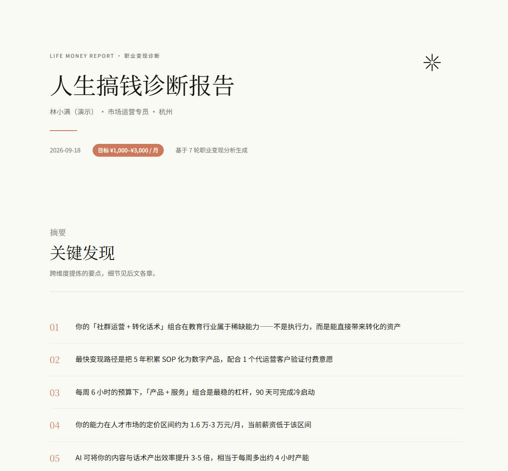
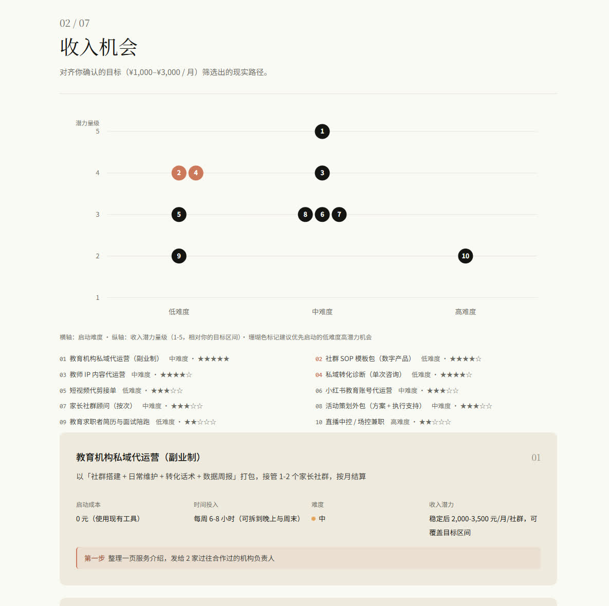
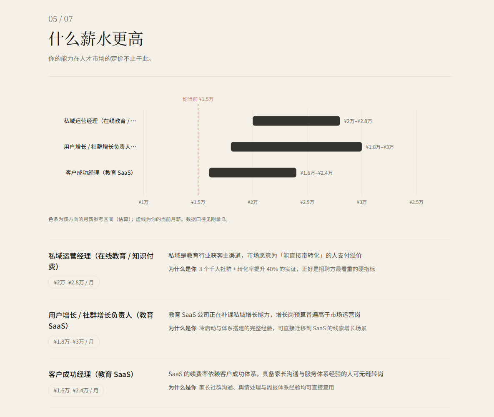
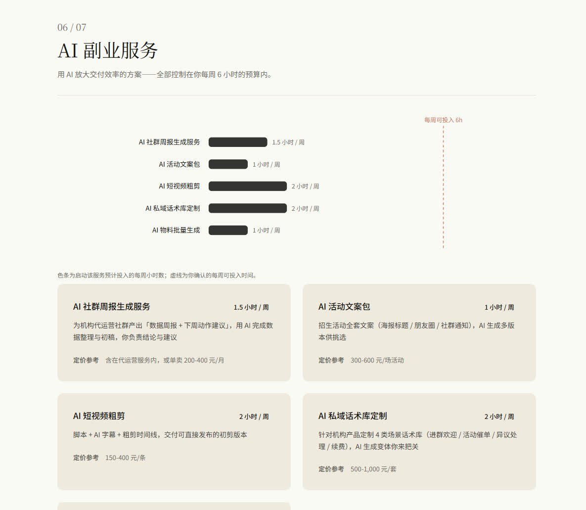
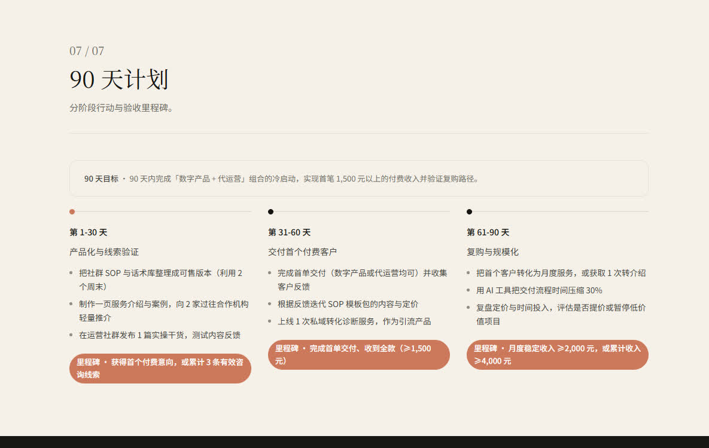
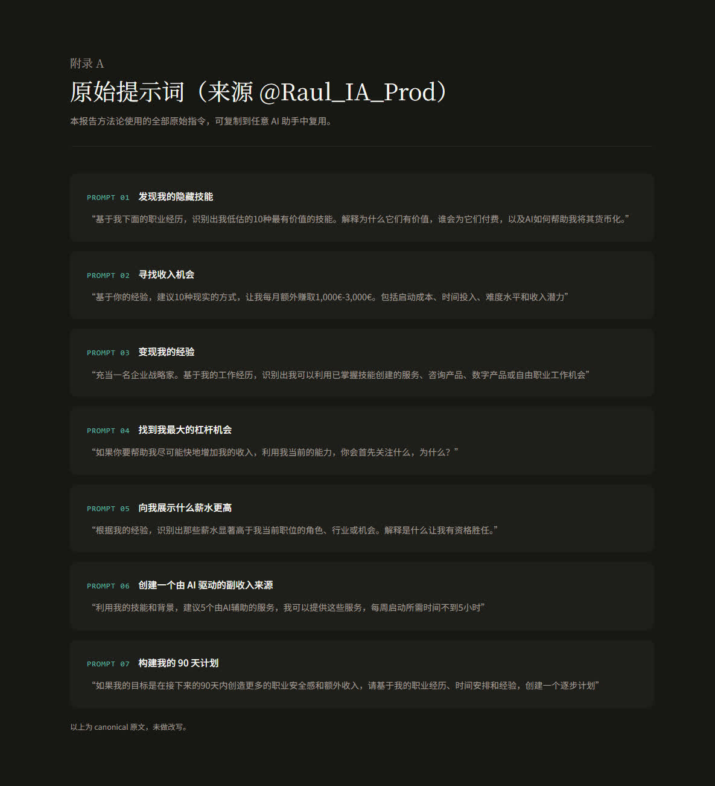

# Life Money Skill — Career Monetization Diagnostic

[简体中文](README.md) ｜ **English**

Turn career monetization into one runnable flow: **profile intake → 7-round analysis → a single-file HTML report you can actually read**.

> Send your résumé and career story in, get a single-file HTML career-monetization diagnostic out — hidden skills, income opportunities, leverage, higher-pay directions, AI side services and a 90-day plan.

> Status: v1.0.0 ｜ Hermes Agent Skill

---

## What it solves

| Pain point | What Life Money does |
|---|---|
| You don't know which of your skills can be sold | Round 1 is a hidden-skills audit — it digs market-payable abilities out of your real experience, with evidence |
| You want a side income but don't know where to start | Every income opportunity ships with a "first step" you can execute this week |
| Plans die after kickoff — no acceptance criteria | The 90-day plan has 3 phases, each with a verifiable milestone |
| Goals are vague ("I want 10k/month") | Gate 2 forces a confirmed monthly extra-income target; every income figure is aligned to it |
| Side-hustle ideas don't fit your real hours | Gate 3 confirms your weekly launch hours; every AI service is capped by that budget |

## How to use

Inside the Agent with this Skill installed, just say:

```
Run a career monetization diagnostic on me — here's my résumé
```

```
I only have 6 hours a week and want an extra 2,000/month — what can I do?
```

The Agent then runs: intake (materials + interview) → 7-round analysis (2 mid-way confirmations) → render report → deliver.

## What the output looks like

`report.html` — single file, opens offline, prints straight to PDF:

| Section | Content |
|---|---|
| Cover / Summary | Identity + target badge + 5 key findings |
| 01 Hidden skills | 10 undervalued abilities (value / who pays / how AI amplifies / evidence) |
| 02 Income opportunities | Opportunity matrix + 10 opportunities (cost / time / difficulty / potential + first step) |
| 03 Monetization paths | Grouped as services / consulting / digital products / freelance |
| 04 Biggest leverage | If you could only do one thing |
| 05 Higher-pay directions | Salary ladder + "why you qualify" |
| 06 AI-powered services | Time-budget chart + 5 AI-leveraged services (capped by your weekly hours) |
| 07 90-day plan | Three-phase timeline + milestones |
| Appendix A / B | The original prompts (copy-paste ready) · sources & disclaimer |

Example output: [**live preview**](https://luojiangyong.github.io/life-money-skill/examples/demo/report.html) | [`examples/demo/report.html`](examples/demo/report.html) — fictional persona, not real data.

## Report preview

> Click any image to open the **live report** (rendered via GitHub Pages).

| Cover · target badge · key findings | Opportunity matrix |
|---|---|
| [](https://luojiangyong.github.io/life-money-skill/examples/demo/report.html) | [](https://luojiangyong.github.io/life-money-skill/examples/demo/report.html) |
| Cover · target badge · 5 key findings | Difficulty × potential, coral = start first |

| Salary ladder | AI service time budget |
|---|---|
| [](https://luojiangyong.github.io/life-money-skill/examples/demo/report.html) | [](https://luojiangyong.github.io/life-money-skill/examples/demo/report.html) |
| Pay ranges vs. "your current" line | Weekly hours per service ≤ your budget |

| 90-day plan timeline | Original prompts (dark appendix) |
|---|---|
| [](https://luojiangyong.github.io/life-money-skill/examples/demo/report.html) | [](https://luojiangyong.github.io/life-money-skill/examples/demo/report.html) |
| Three phases + verifiable milestones | The 7 canonical prompts, copy-paste ready |

## Workflow

```
Your materials + interview
    │
    ├─ L1 Intake ────Gate 1──▶ profile.json
    ├─ L2 Analysis ──Gate 2/3▶ analysis.json (7 rounds)
    ├─ L3 Render ────────────▶ report.html
    └─ L4 Verify & deliver ──▶ projects/<YYYY-MM-DD>-<slug>/
```

**Not doing**: no external LLM API (the Agent runs the analysis); no user data in the repository; no income guarantees.

## The three gates (cannot be skipped)

| Gate | Trigger point | What the user does | Default |
|---|---|---|---|
| 1 | L1 intake | Provide materials (résumé / project reports / portfolio) and confirm | — |
| 2 | After hidden skills, before income opportunities | Choose the monthly extra-income target | 1,000-3,000 CNY / month |
| 3 | Before AI services | Enter weekly launch hours | 6 hours |

## Repository layout

```
life-money-skill/
├── SKILL.md                     ← routing hub (entry point)
├── CONSTITUTION.md              ← design constitution (5 principles / 7 dimensions / anti-patterns)
├── README.md / README.en.md     ← Chinese / English docs
├── LICENSE                      ← MIT
├── docs/images/                 ← README assets (report preview shots)
├── references/                  ← domain knowledge (loaded on demand)
│   ├── seven-prompts.md         ← canonical prompts (single source of truth)
│   ├── interview-guide.md       ← intake protocol + Gate 1
│   ├── analysis-specs.md        ← 7-round analysis spec + Gates 2/3
│   ├── report-design.md         ← report design system + chart specs
│   ├── data-calibration.md      ← market calibration (optional, ≤3 searches)
│   └── cases/                   ← case library (index + template + cases)
├── scripts/
│   ├── render_report.py         ← analysis.json → report.html (with validation)
│   └── verify_repo.py           ← repo self-check (contract + render + structure)
├── assets/
│   ├── schemas/                 ← the two public contracts (profile / analysis)
│   └── templates/report.css     ← report stylesheet
├── examples/demo/               ← full fictional example (incl. rendered report)
├── projects/                    ← run outputs (gitignored; contains user data)
└── .github/workflows/ci.yml     ← CI: same self-check on every push
```

## Installation

This repository is the **development repo (single source of truth)**; the copy installed inside Hermes is a thin router. Installation is not done yet.

```bash
git clone https://github.com/LuoJiangYong/life-money-skill.git
```

## Self-check

```bash
python scripts/verify_repo.py
```

1. **Contract validation** — examples ↔ both JSON Schemas (zero-dependency validator with a keyword whitelist; fails loudly instead of passing silently)
2. **Render smoke test** — runs `render_report.py` and produces a report
3. **Structure check** — component counts must match exactly (10 / 10 / 5 / 3 / 5 / 7 / 3 / 5 / 10)

CI runs the same checks on every push, plus a repository boundary check (`projects/` must never be committed).

## Credits

The methodology is adapted from **@Raul_IA_Prod** on X — 7 prompts (originally in Spanish, translated and localized) that turn "I don't know what I can do" into an actionable monetization path. The 7 analysis dimensions are rebuilt to this Skill's spec; the report appendix keeps the original prompts verbatim so they stay reusable.

> Canonical prompts: [`references/seven-prompts.md`](references/seven-prompts.md)

## License

[MIT](LICENSE) © 2026 Jiang Yong Luo
